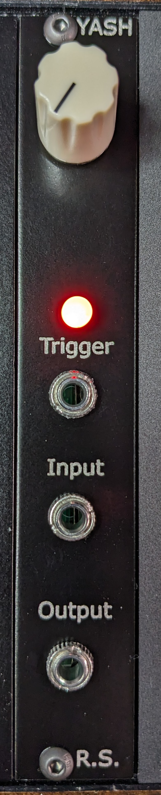
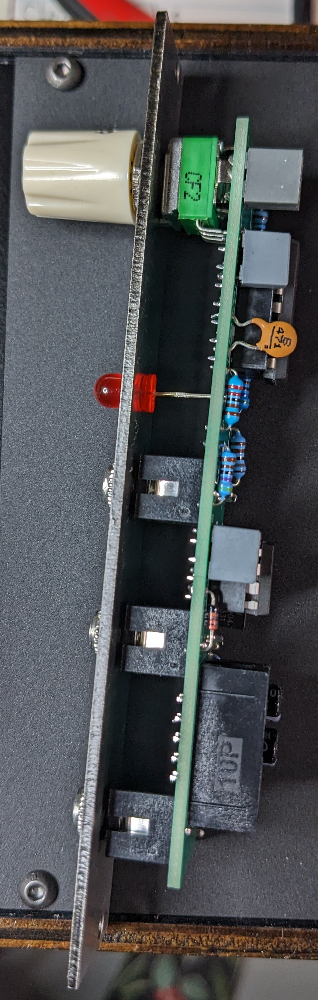
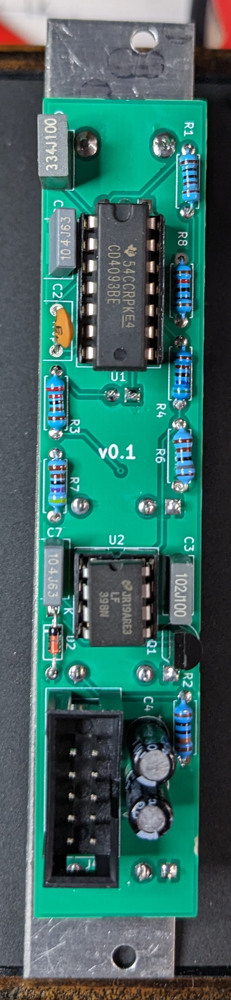

# YASH (Yet another sample and hold)
[Original project](https://www.schmitzbits.de/sah.html) by Rene Schmitz.

# Stats
- 4HP

# BOM
| Part | Quantity | Link |
|----|----|----|
| CD4093 | 1 | [Tayda](https://www.taydaelectronics.com/cd4093-4093-ic-cmos-nand-schmitt-trigger.html) |
| LF398 | 1 | [ebay](https://www.ebay.com/itm/123885878582) |
| 2N3904 | 1 | [Tayda](https://www.taydaelectronics.com/2n3904-npn-general-propose-transistor.html) |
| 1N4148 | 1 | [Tayda](https://www.taydaelectronics.com/1n4148-switching-signal-diode.html) |
| LED | 1 | [Tayda](https://www.taydaelectronics.com/led-5mm-red.html) |
| 470pF cap | 1 | [Tayda](https://www.taydaelectronics.com/470pf-100v-ceramic-disc-capacitor-pkg-of-10-aec.html) |
| 1nF cap | 1 | [Tayda](https://www.taydaelectronics.com/1nf-0-001uf-100v-5-polyester-film-box-type-capacitor.html) |
| 100nF cap | 2 | [Tayda](https://www.taydaelectronics.com/0-1uf-100v-5-polyester-film-box-type-capacitor.html) |
| 470nF cap | 1 | [Tayda](https://www.taydaelectronics.com/0-47uf-100v-5-polyester-film-box-type-capacitor.html) |
| 10uF cap | 2 | [Tayda](https://www.taydaelectronics.com/10uf-50v-105c-radial-electrolytic-capacitor-5x11mm.html) |
| Mono audio jack | 3 | [Tayda](https://www.taydaelectronics.com/pj-3001f-3-5-mm-mono-phone-jack.html) |
| Power box header | 1 | [Tayda](https://www.taydaelectronics.com/10-pin-box-header-connector-2-54mm.html) |
| 1M Pot | 1 | [Tayda](https://www.taydaelectronics.com/1m-ohm-linear-taper-potentiometer-round-shaft-pcb-9mm.html) |
| 1k   | 1 | [Tayda](https://www.taydaelectronics.com/10-x-resistor-1k-ohm-1-4w-1-metal-film-pkg-of-10.html) |
| 1.8k | 1 | [Tayda](https://www.taydaelectronics.com/resistor-1-8k-ohm-1-4w-1-metal-film-pkg-of-10.html) |
| 2.2k | 1 | [Tayda](https://www.taydaelectronics.com/resistor-2-2k-ohm-1-4w-1-metal-film-pkg-of-10.html) |
| 4.7k | 1 | [Tayda](https://www.taydaelectronics.com/10-x-resistor-4-7k-ohm-1-4w-1-metal-film-pkg-of-10.html) |
| 5.6k | 1 | [Tayda](https://www.taydaelectronics.com/10-x-resistor-5-6k-ohm-1-4w-1-metal-film-pkg-of-10.html) |
| 10k  | 1 | [Tayda](https://www.taydaelectronics.com/10-x-resistor-10k-ohm-1-4w-1-metal-film-pkg-of-10.html) |
| 100k | 1 | [Tayda](https://www.taydaelectronics.com/10-x-resistor-100k-ohm-1-4w-1-metal-film-pkg-of-10.html) |